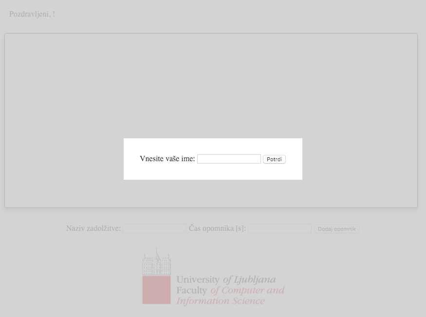
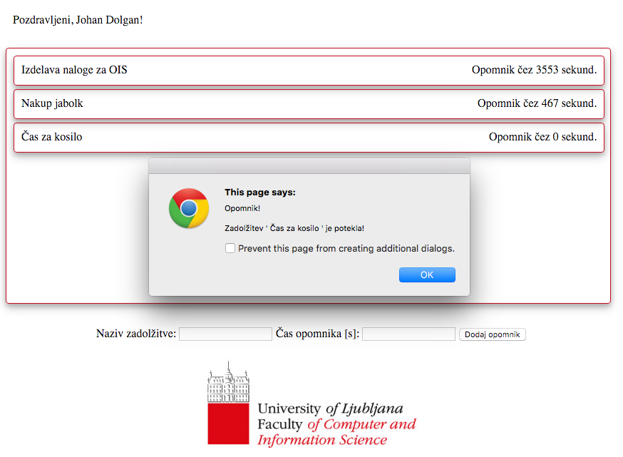

# Javascript in razvoj enostavnih odjemalskih aplikacij

2\. vaje pri predmetu [Osnove informacijskih sistemov](https://ucilnica1516.fri.uni-lj.si/course/view.php?id=54)

## Vzpostavitev okolja

* Izdelajte lastno vejo (*fork*) projekta [Opomniki](https://github.com/szitnik/opomniki). 
* V okolju [Cloud9](https://c9.io) si z orodjem git ustvarite kopijo projekta.
* Sledite spodnjim navodilom, da boste dopolnili obstoječ projekt tako, da bo vaša končna verzija aplikacije z delujočimi funkcionalnostmi izgledala sledeče:




## Naloga

V mapi *opomniki* se nahaja delno izdelana spletna stran _opomniki.html_. Ker je razvijalcem majhnega startupa zmanjkalo časa za dokončno izdelavo spletne strani, je vaša naloga, da podprete sledeče funkcionalnosti.

1. V zaglavje HTML datoteke _opomniki.html_ dodajte povezavo na datoteko s stili (*stili.css*) in na datoteko z Javascript kodo (*skripta.js*).
2. Na prvotni celozaslonski maski nastavite, da je 15% prosojna, da se lahko vidijo tudi spodnje komponente. Spremembo izvedite v datoteki *stili.css*.
3. Implementirajte funkcijo, ki naj se izvede ob kliku na gumb *Potrdi*. Funkcija naj stori sledeče:

	* pridobi vrednost vnešenega imena
	* nastavi vrednost vnešenega imena kot HTML vsebino v polje z id-jem *uporabnik*
	* skrije prekrivno okno (HTML element s stilom *pokrivalo*), da se pokaže glavna vsebina strani.

4. Vaše spremembe shranite s commit sporočilom "Implementirana prijava" in spremembe uveljavite na oddaljenem git strežniku.
5. V svojem repozitoriju izdelajte lokalno in oddaljeno razvojno vejo z imenom "opomniki" ter nadaljujte razvoj v novi veji.
6. Implementirajte funkcijo dodaj opomnik, ki se izvede ob kliku na gumb *Dodaj opomnik*. Funkcija naj stori sledeče:

	* pridobi vnešeni vrednosti za naziv in čas trajanja opomnika
	* resetira vrednosti vnosnih polj
	* v HTML element z id-jem opomniki doda sledečo HTML kodo, v katero vstavite vrednosti, ki jih je vnesel uporabnik:

	```
<div class='opomnik'>
				<div class='naziv_opomnika'>NAZIV_OPOMNIKA</div>
				<div class='cas_opomnika'> Opomnik čez <span>CAS_OPOMNIKA</span> sekund.</div>
</div>
	```

7. Ko vam dodajanje novih opomnikov deluje, commitajte spremembe v vašo trenutno vejo s komentarjem "Dodajanje opomnikov". Spremembe uveljavite tudi na istoimenski oddaljeni veji in nato združite spremembe v glavno vejo (*master*). Razvoj nadaljujte na glavni veji razvoja.
8. V spodnjem delu dokumenta *skripta.js* boste opazili del kode, ki posodablja opomnike. Vrstica `setInterval(posodobiOpomnike, 1000)` definira, da se funkcija *posodobiOpomnike* pokliče enkrat na sekundo. Zaradi časovnih omejitev pa funkcija ni popolnoma implementirana, zato jo dokončajte.
9. Poskrbite za lepši grafični izgled spletne strani in HTML komponenti z id-jem *opomniki* dodajte že pripravljena stila *senca* in *rob*. Prav tako ta dva stila dodajte komponenti, ki jo dodate z ustvarjanjem novega opomnika.
10. Commitajte spremembe na glavni veji s komentarjem "Stran pripravljena za produkcijo" in uveljavite spremembe tudi v oddaljenem repozitoriju.